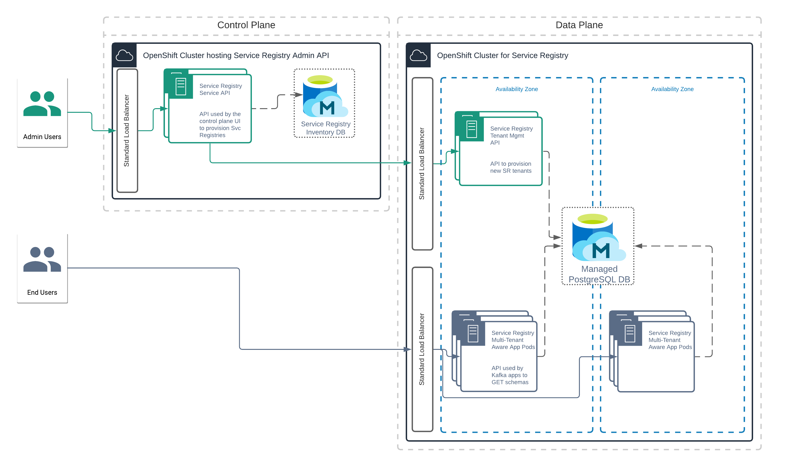

# Managed Multi-Tenant Service Registry - The Demo!

## Pre-requisites

#### Tools

This demo guide uses several tools that may not be installed in your machine:
* [jq](https://stedolan.github.io/jq/)
* [jbang](https://www.jbang.dev/)
* [Openshift client](https://docs.openshift.com/container-platform/4.6/cli_reference/openshift_cli/getting-started-cli.html)

For having fancy outputs in this demo we are going to alias the `curl` command:
```
alias curl="curl -s -D \"/dev/stderr\""
```
[[^ execute]](didact://?commandId=vscode.didact.sendNamedTerminalAString&text=sr$$alias%20curl%3D%22curl%20-s%20-D%20%5C%22%2Fdev%2Fstderr%5C%22%22 "Opens a new terminal and sends the command above"){.didact}

### Deployment on Openshift

For this demo you need an Openshift cluster and to provision all the components and infrastructure that make the Managed Multi-Tenant Service Registry.

We are going to deploy everything in the namespace `managed-service-registry`. To create it, execute the following command:

```
oc new-project managed-service-registry
```
[[^ execute]](didact://?commandId=vscode.didact.sendNamedTerminalAString&text=sr$$oc%20new-project%20managed-service-registry "Opens a new terminal and sends the command above"){.didact}

#### 1. Keycloak

For this demo we are deploying a Keycloak instance that will be used by the Service Registry for the authentication of the tenants. Deploy the Keycloak instance with this commands:

First deploy the keycloak operator.
```
oc apply -f dist/openshift/templates/keycloak/00-operator.yaml
```
[[^ execute]](didact://?commandId=vscode.didact.sendNamedTerminalAString&text=sr$$oc%20apply%20-f%20dist%2Fopenshift%2Ftemplates%2Fkeycloak%2F00-operator.yaml "Opens a new terminal and sends the command above"){.didact}

Wait for the operator to be running, execute this command until the keycloak-operator is running.
```
oc get pod | grep keycloak-operator
```
[[^ execute]](didact://?commandId=vscode.didact.sendNamedTerminalAString&text=sr$$oc%20get%20pod%20%7C%20grep%20keycloak-operator "Opens a new terminal and sends the command above"){.didact}

Then deploy the keycloak instance
```
oc apply -f dist/openshift/templates/keycloak/01-keycloak.yaml
```
[[^ execute]](didact://?commandId=vscode.didact.sendNamedTerminalAString&text=sr$$oc%20apply%20-f%20dist%2Fopenshift%2Ftemplates%2Fkeycloak%2F01-keycloak.yaml "Opens a new terminal and sends the command above"){.didact}

Wait for the keycloak instance to be running, execute this command until the keycloak instance is running.
```
oc get pod | grep keycloak
```
[[^ execute]](didact://?commandId=vscode.didact.sendNamedTerminalAString&text=sr$$oc%20get%20pod%20%7C%20grep%20keycloak "Opens a new terminal and sends the command above"){.didact}

#### 2. Managed Multi-Tenant Service Registry infrastucture components

Once we have the keycloak instance we can deploy the rest of the infrastructure components that make the Managed Multi-Tenant Service Registry.

First create the config maps for centralizing some configurations. Execute the following commands:
```
sed s,{KEYCLOAK_ROUTE_PLACEHOLDER},$(oc get route keycloak --template='{{ .spec.host }}'),g dist/openshift/templates/config/00-apicurio-registry-configmap.yaml | oc apply -f -
```
[[^ execute]](didact://?commandId=vscode.didact.sendNamedTerminalAString&text=sr$$sed%20s%2C%7BKEYCLOAK_ROUTE_PLACEHOLDER%7D%2C%24%28oc%20get%20route%20keycloak%20--template%3D%27%7B%7B%20.spec.host%20%7D%7D%27%29%2Cg%20dist%2Fopenshift%2Ftemplates%2Fconfig%2F00-apicurio-registry-configmap.yaml%20%7C%20oc%20apply%20-f%20- "Opens a new terminal and sends the command above"){.didact}

```
sed s,{KEYCLOAK_ROUTE_PLACEHOLDER},$(oc get route keycloak --template='{{ .spec.host }}'),g dist/openshift/templates/config/00-service-api-configmap.yaml | oc apply -f -
```
[[^ execute]](didact://?commandId=vscode.didact.sendNamedTerminalAString&text=sr$$sed%20s%2C%7BKEYCLOAK_ROUTE_PLACEHOLDER%7D%2C%24%28oc%20get%20route%20keycloak%20--template%3D%27%7B%7B%20.spec.host%20%7D%7D%27%29%2Cg%20dist%2Fopenshift%2Ftemplates%2Fconfig%2F00-service-api-configmap.yaml%20%7C%20oc%20apply%20-f%20- "Opens a new terminal and sends the command above"){.didact}

Now you can deploy the rest of the components. Execute the following command:
```
oc apply -f dist/openshift/templates
```
[[^ execute]](didact://?commandId=vscode.didact.sendNamedTerminalAString&text=sr$$oc%20apply%20-f%20dist%2Fopenshift%2Ftemplates "Opens a new terminal and sends the command above"){.didact}


And wait until all the pods are ready, it's possible that some pods will restart a few times, this can happen because other services they depend on are still being initialized.
Check that all the pods are running.
```
oc get pod
```
[[^ execute]](didact://?commandId=vscode.didact.sendNamedTerminalAString&text=sr$$oc%20get%20pod "Opens a new terminal and sends the command above"){.didact}

Execute this command to prepare the environment for the demo:
```
source scripts/demo/env.sh
```
[[^ execute]](didact://?commandId=vscode.didact.sendNamedTerminalAString&text=sr$$source%20scripts%2Fdemo%2Fenv.sh "Opens a new terminal and sends the command above"){.didact}

After this is done we need to "register" the Service Registry deployment in the "control-plane" to finish the set up of this Managed platform. To do this
you need the Service Registry and Tenant Manager URLs. The URLs are already captued in env variables by the previous command. However you can check the URLs of all the components with this command:
```
oc get route
```
[[^ execute]](didact://?commandId=vscode.didact.sendNamedTerminalAString&text=sr$$oc%20get%20route "Opens a new terminal and sends the command above"){.didact}

Execute this command to register the Service Registry deployment in the control plane:
```
curl --header "Content-Type: application/json" --request POST --data '{"tenantManagerUrl":"'$TENANT_MANAGER_URL'", "registryDeploymentUrl":"'$REGISTRY_URL'"}' $SERVICE_API_URL/api/v1/admin/registry-deployments
```
[[^ execute]](didact://?commandId=vscode.didact.sendNamedTerminalAString&text=sr$$curl%20--header%20%22Content-Type%3A%20application%2Fjson%22%20--request%20POST%20--data%20%27%7B%22tenantManagerUrl%22%3A%22%27%24TENANT_MANAGER_URL%27%22%2C%20%22registryDeploymentUrl%22%3A%22%27%24REGISTRY_URL%27%22%7D%27%20%24SERVICE_API_URL%2Fapi%2Fv1%2Fadmin%2Fregistry-deployments "Opens a new terminal and sends the command above"){.didact}

After this you should be able to see there is one Registry deployment with status AVAILABLE. Execute this command to see it:
```
curl $SERVICE_API_URL/api/v1/admin/registry-deployments | jq
```
[[^ execute]](didact://?commandId=vscode.didact.sendNamedTerminalAString&text=sr$$curl%20%24SERVICE_API_URL%2Fapi%2Fv1%2Fadmin%2Fregistry-deployments%20%7C%20jq "Opens a new terminal and sends the command above"){.didact}


## The Demo!



We currently have all the components in place that conform a Managed Multi-Tenant Service Registry platform. 
The "control-plane" is represented by the "service-api" pods plus it's postgresql database. The control plane receives the requests for provisioning
Service Registry instances (tenants).
The "data-plane" is represented by the "apicurio-registry" pods , the "tenant-manager" pods and the "apicurio-registry" database.

In this demo we are going to provision two Service Registry instances, a.k.a two tenants, and we are going to show a basic example of different tenants
authenticating and using a shared Multi-Tenant Service Registry deployment.

### 1. Create a Service Registry Instance

To start, check there are no Service Registry instances (tenants) created yet. To check it, execute the following command:
```
curl $SERVICE_API_URL/api/v1/registries | jq
```
[[^ execute]](didact://?commandId=vscode.didact.sendNamedTerminalAString&text=sr$$curl%20%24SERVICE_API_URL%2Fapi%2Fv1%2Fregistries%20%7C%20jq "Opens a new terminal and sends the command above"){.didact}


Create the first Service Registry instance, we are going to call it tenant-a. Execute the following command to create it:
```
curl --header "Content-Type: application/json" --request POST --data '{"name":"tenant-a"}' $SERVICE_API_URL/api/v1/registries
```
[[^ execute]](didact://?commandId=vscode.didact.sendNamedTerminalAString&text=sr$$curl%20--header%20%22Content-Type%3A%20application%2Fjson%22%20--request%20POST%20--data%20%27%7B%22name%22%3A%22tenant-a%22%7D%27%20%24SERVICE_API_URL%2Fapi%2Fv1%2Fregistries "Opens a new terminal and sends the command above"){.didact}


After this several things happened:
* The information of a new tenant was created in the "service-api" database
* A new realm was created in the keycloak instance (to be removed in the future, realm will already exist)
* The required Service Registry roles were created in the keycloak realm, the roles are `sr-admin`, `sr-developer`, `sr-readonly`
* Two required Service Registry clients were created in the keycloak realm. The clients are `apicurio-registry` which will be used by users to authenticate and `registry-api` used by the registry to validate incoming requests.
* The tenant was assigned to one Service Registry deployment (in our case there's only one deployment...) and the tenant information was stored in the Service Registry deployment database by the Tenant Manager.
* A URL is assigned for this tenant in the target Service Registry deployment

Execute this command to check the tenant-a is status AVAILABLE:
```
curl $SERVICE_API_URL/api/v1/registries | jq -r '.[] | select(.name == "tenant-a")'
```
[[^ execute]](didact://?commandId=vscode.didact.sendNamedTerminalAString&text=sr$$curl%20%24SERVICE_API_URL%2Fapi%2Fv1%2Fregistries%20%7C%20jq%20-r%20%27.%5B%5D%20%7C%20select%28.name%20%3D%3D%20%22tenant-a%22%29%27 "Opens a new terminal and sends the command above"){.didact}


### 2. Additional configuration for tenant-a

Execute this command to prepare the env and save the tenant URL:
```
export URL_TENANT_A=$(curl $SERVICE_API_URL/api/v1/registries | jq -r '.[] | select(.name == "tenant-a") | .appUrl')
```
[[^ execute]](didact://?commandId=vscode.didact.sendNamedTerminalAString&text=sr$$export%20URL_TENANT_A%3D%24%28curl%20%24SERVICE_API_URL%2Fapi%2Fv1%2Fregistries%20%7C%20jq%20-r%20%27.%5B%5D%20%7C%20select%28.name%20%3D%3D%20%22tenant-a%22%29%20%7C%20.appUrl%27%29 "Opens a new terminal and sends the command above"){.didact}


To be able to authenticate and access the registry we need to at least have a user in the recently created keycloak realm. We have a script to do that quickly, execute this commands:
```
export ID_TENANT_A=$(curl $SERVICE_API_URL/api/v1/registries | jq -r '.[] | select(.name == "tenant-a") | .id')
```
[[^ execute]](didact://?commandId=vscode.didact.sendNamedTerminalAString&text=sr$$export%20ID_TENANT_A%3D%24%28curl%20%24SERVICE_API_URL%2Fapi%2Fv1%2Fregistries%20%7C%20jq%20-r%20%27.%5B%5D%20%7C%20select%28.name%20%3D%3D%20%22tenant-a%22%29%20%7C%20.id%27%29 "Opens a new terminal and sends the command above"){.didact}

```
./scripts/demo/CreateKeycloakUser.java $ID_TENANT_A
```
[[^ execute]](didact://?commandId=vscode.didact.sendNamedTerminalAString&text=sr$$.%2Fscripts%2Fdemo%2FCreateKeycloakUser.java%20%24ID_TENANT_A "Opens a new terminal and sends the command above"){.didact}

This created a user `sr-admin-tenant-$ID_TENANT_A` with password `password` in the realm `sr-tenant-$ID_TENANT_A`.

### 3. Tenant-a uses the registry

Now tenant-a can authenticate to the Service Registry, let's verify it queriying the registry for artifacts.

Let's check first if the authentication layer actually works. If we don't provide an access token the request should be rejected. Try this command:
```
curl $URL_TENANT_A/api/search/artifacts
```
[[^ execute]](didact://?commandId=vscode.didact.sendNamedTerminalAString&text=sr$$curl%20%24URL_TENANT_A%2Fapi%2Fsearch%2Fartifacts "Opens a new terminal and sends the command above"){.didact}

Then you need to get an access token to authenticate against the registry:
```
export TOKEN_TENANT_A=$(curl -k --location --request POST $AUTH_SERVER_URL/realms/sr-tenant-$ID_TENANT_A/protocol/openid-connect/token \
--header 'Content-Type: application/x-www-form-urlencoded' \
--data-urlencode 'grant_type=password' \
--data-urlencode 'client_id=apicurio-registry' \
--data-urlencode "username=sr-admin-tenant-$ID_TENANT_A" \
--data-urlencode 'password=password' | jq -r .access_token )
```
[[^ execute]](didact://?commandId=vscode.didact.sendNamedTerminalAString&text=sr$$export%20TOKEN_TENANT_A%3D%24%28curl%20-k%20--location%20--request%20POST%20%24AUTH_SERVER_URL%2Frealms%2Fsr-tenant-%24ID_TENANT_A%2Fprotocol%2Fopenid-connect%2Ftoken%20--header%20%27Content-Type%3A%20application%2Fx-www-form-urlencoded%27%20--data-urlencode%20%27grant_type%3Dpassword%27%20--data-urlencode%20%27client_id%3Dapicurio-registry%27%20--data-urlencode%20%22username%3Dsr-admin-tenant-%24ID_TENANT_A%22%20--data-urlencode%20%27password%3Dpassword%27%20%7C%20jq%20-r%20.access_token%20%29 "Opens a new terminal and sends the command above"){.didact}


And now we can query the registry using the URL for tenant-a and the token we just requested:
```
curl $URL_TENANT_A/api/search/artifacts --header "Authorization: Bearer $TOKEN_TENANT_A" | jq
```
[[^ execute]](didact://?commandId=vscode.didact.sendNamedTerminalAString&text=sr$$curl%20%24URL_TENANT_A%2Fapi%2Fsearch%2Fartifacts%20--header%20%22Authorization%3A%20Bearer%20%24TOKEN_TENANT_A%22%20%7C%20jq "Opens a new terminal and sends the command above"){.didact}

You can see there are no artifacts.

Let's create an artifact:
```
curl --data "@scripts/demo/example-schema.json" -X POST $URL_TENANT_A/api/artifacts --header "Authorization: Bearer $TOKEN_TENANT_A" | jq
```
[[^ execute]](didact://?commandId=vscode.didact.sendNamedTerminalAString&text=sr$$curl%20--data%20%22%40scripts%2Fdemo%2Fexample-schema.json%22%20-X%20POST%20%24URL_TENANT_A%2Fapi%2Fartifacts%20--header%20%22Authorization%3A%20Bearer%20%24TOKEN_TENANT_A%22%20%7C%20jq "Opens a new terminal and sends the command above"){.didact}


And now we can query the registry again and see the just created artifact:
```
curl $URL_TENANT_A/api/search/artifacts --header "Authorization: Bearer $TOKEN_TENANT_A" | jq
```
[[^ execute]](didact://?commandId=vscode.didact.sendNamedTerminalAString&text=sr$$curl%20%24URL_TENANT_A%2Fapi%2Fsearch%2Fartifacts%20--header%20%22Authorization%3A%20Bearer%20%24TOKEN_TENANT_A%22%20%7C%20jq "Opens a new terminal and sends the command above"){.didact}


### 4. Create another Service Registry Instance

Let's provision another Service Registry instance, this time we are going to call it tenant-b. Execute the following command to create it:
```
curl --header "Content-Type: application/json" --request POST --data '{"name":"tenant-b"}' $SERVICE_API_URL/api/v1/registries
```
[[^ execute]](didact://?commandId=vscode.didact.sendNamedTerminalAString&text=sr$$curl%20--header%20%22Content-Type%3A%20application%2Fjson%22%20--request%20POST%20--data%20%27%7B%22name%22%3A%22tenant-b%22%7D%27%20%24SERVICE_API_URL%2Fapi%2Fv1%2Fregistries "Opens a new terminal and sends the command above"){.didact}


Again several things were created for this Service Registry instance: a new keycloak realm, some roles and clients in that realm, and a new tenant assigned to our only deployment and registered in the Tenant Manager.

Execute this command to check the tenant-b is status AVAILABLE:
```
curl $SERVICE_API_URL/api/v1/registries | jq -r '.[] | select(.name == "tenant-b")'
```
[[^ execute]](didact://?commandId=vscode.didact.sendNamedTerminalAString&text=sr$$curl%20%24SERVICE_API_URL%2Fapi%2Fv1%2Fregistries%20%7C%20jq%20-r%20%27.%5B%5D%20%7C%20select%28.name%20%3D%3D%20%22tenant-b%22%29%27 "Opens a new terminal and sends the command above"){.didact}


### 5. Additional configuration for tenant-b

Execute this command to prepare the env and save the tenant URL:
```
export URL_TENANT_B=$(curl $SERVICE_API_URL/api/v1/registries | jq -r '.[] | select(.name == "tenant-b") | .appUrl')
```
[[^ execute]](didact://?commandId=vscode.didact.sendNamedTerminalAString&text=sr$$export%20URL_TENANT_B%3D%24%28curl%20%24SERVICE_API_URL%2Fapi%2Fv1%2Fregistries%20%7C%20jq%20-r%20%27.%5B%5D%20%7C%20select%28.name%20%3D%3D%20%22tenant-b%22%29%20%7C%20.appUrl%27%29 "Opens a new terminal and sends the command above"){.didact}


To be able to authenticate and access the registry we need to at least have a user in the recently created keycloak realm. We have a script to do that quickly, execute this commands:
```
export ID_TENANT_B=$(curl $SERVICE_API_URL/api/v1/registries | jq -r '.[] | select(.name == "tenant-b") | .id')
```
[[^ execute]](didact://?commandId=vscode.didact.sendNamedTerminalAString&text=sr$$export%20ID_TENANT_B%3D%24%28curl%20%24SERVICE_API_URL%2Fapi%2Fv1%2Fregistries%20%7C%20jq%20-r%20%27.%5B%5D%20%7C%20select%28.name%20%3D%3D%20%22tenant-b%22%29%20%7C%20.id%27%29 "Opens a new terminal and sends the command above"){.didact}

```
./scripts/demo/CreateKeycloakUser.java $ID_TENANT_B
```
[[^ execute]](didact://?commandId=vscode.didact.sendNamedTerminalAString&text=sr$$.%2Fscripts%2Fdemo%2FCreateKeycloakUser.java%20%24ID_TENANT_B "Opens a new terminal and sends the command above"){.didact}

This created a user `sr-admin-tenant-$ID_TENANT_B` with password `password` in the realm `sr-tenant-$ID_TENANT_B`.

### 6. Multi-Tenat Service Registry in action

After the provisioning of tenant-b now we have two Service Registry Instances provisioned and sharing the same Service Registry deployment.
Execute this command to see all the Service Registry Instances provisioned:
```
curl $SERVICE_API_URL/api/v1/registries | jq
```
[[^ execute]](didact://?commandId=vscode.didact.sendNamedTerminalAString&text=sr$$curl%20%24SERVICE_API_URL%2Fapi%2Fv1%2Fregistries%20%7C%20jq "Opens a new terminal and sends the command above"){.didact}

### 7. Test tenant-b

Let's test the second Service Registry Instance we created, tenant-b.

First request an access token:
```
export TOKEN_TENANT_B=$(curl -k --location --request POST $AUTH_SERVER_URL/realms/sr-tenant-$ID_TENANT_B/protocol/openid-connect/token \
--header 'Content-Type: application/x-www-form-urlencoded' \
--data-urlencode 'grant_type=password' \
--data-urlencode 'client_id=apicurio-registry' \
--data-urlencode "username=sr-admin-tenant-$ID_TENANT_B" \
--data-urlencode 'password=password' | jq -r .access_token )
```
[[^ execute]](didact://?commandId=vscode.didact.sendNamedTerminalAString&text=sr$$export%20TOKEN_TENANT_B%3D%24%28curl%20-k%20--location%20--request%20POST%20%24AUTH_SERVER_URL%2Frealms%2Fsr-tenant-%24ID_TENANT_B%2Fprotocol%2Fopenid-connect%2Ftoken%20--header%20%27Content-Type%3A%20application%2Fx-www-form-urlencoded%27%20--data-urlencode%20%27grant_type%3Dpassword%27%20--data-urlencode%20%27client_id%3Dapicurio-registry%27%20--data-urlencode%20%22username%3Dsr-admin-tenant-%24ID_TENANT_B%22%20--data-urlencode%20%27password%3Dpassword%27%20%7C%20jq%20-r%20.access_token%20%29 "Opens a new terminal and sends the command above"){.didact}


Now you can check there are no artifacts in Service Registry Instance tenant-b:
```
curl $URL_TENANT_B/api/search/artifacts --header "Authorization: Bearer $TOKEN_TENANT_B" | jq
```
[[^ execute]](didact://?commandId=vscode.didact.sendNamedTerminalAString&text=sr$$curl%20%24URL_TENANT_B%2Fapi%2Fsearch%2Fartifacts%20--header%20%22Authorization%3A%20Bearer%20%24TOKEN_TENANT_B%22%20%7C%20jq "Opens a new terminal and sends the command above"){.didact}

You can see there are no artifacts.

Try creating several artifacts in Service Registry Instance tenant-b:
```
for i in $(seq 1 5); do curl --data "@scripts/demo/example-schema.json" -X POST $URL_TENANT_B/api/artifacts --header "Authorization: Bearer $TOKEN_TENANT_B" --header "X-Registry-ArtifactId: test-artifact-$i" | jq ; done
```
[[^ execute]](didact://?commandId=vscode.didact.sendNamedTerminalAString&text=sr$$for%20i%20in%20%24%28seq%201%205%29%3B%20do%20curl%20--data%20%22%40scripts%2Fdemo%2Fexample-schema.json%22%20-X%20POST%20%24URL_TENANT_B%2Fapi%2Fartifacts%20--header%20%22Authorization%3A%20Bearer%20%24TOKEN_TENANT_B%22%20--header%20%22X-Registry-ArtifactId%3A%20test-artifact-%24i%22%20%7C%20jq%20%3B%20done "Opens a new terminal and sends the command above"){.didact}


Finally you can see all the artifacts we just created:
```
curl $URL_TENANT_B/api/search/artifacts --header "Authorization: Bearer $TOKEN_TENANT_B" | jq
```
[[^ execute]](didact://?commandId=vscode.didact.sendNamedTerminalAString&text=sr$$curl%20%24URL_TENANT_B%2Fapi%2Fsearch%2Fartifacts%20--header%20%22Authorization%3A%20Bearer%20%24TOKEN_TENANT_B%22%20%7C%20jq "Opens a new terminal and sends the command above"){.didact}

